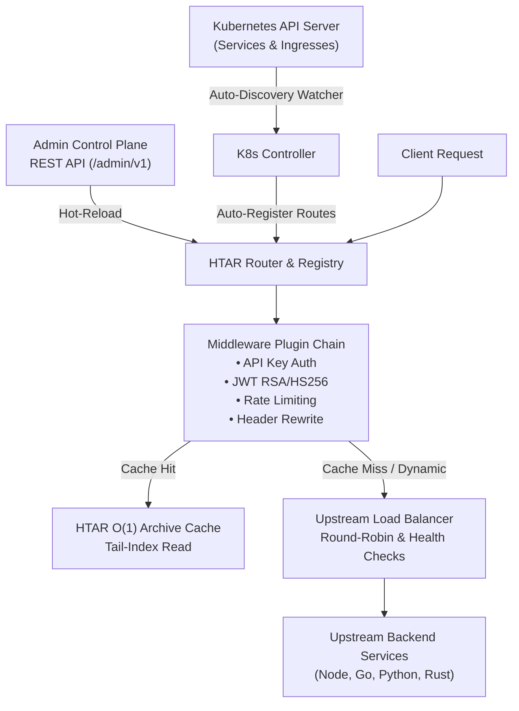

# HTAR Enterprise API Gateway (`htar-gateway`)

**HTAR Gateway** is an enterprise-grade API Gateway written in **Rust** (powered by Tokio, Hyper, and Tower). It combines **Kubernetes Automated Service & Ingress Discovery**, **Kong-compatible dynamic service management & middleware plugin chains**, and a novel **Hybrid TAR + Hashtable (`.htar`)** microsecond response caching engine.

---

## Architecture & Gateway Capabilities



---

## Features Overview

### 1. Automated Kubernetes Service & Ingress Discovery
* **Real-time Event Watcher**: Watches Kubernetes `Service` and `Ingress` events using the official `kube-rs` controller framework.
* **Automatic Route Registration**: When a Kubernetes `Service` with annotation `htar.gateway/enable: "true"` or any `Ingress` resource is deployed, `htar-gateway` automatically registers the upstream DNS target (`http://<service>.<namespace>.svc.cluster.local:<port>`) and routing paths into the Gateway in real-time.
* **Automatic Teardown**: Automatically removes routes when K8s services or ingresses are deleted.

### 2. Multi-stage Docker Container & RBAC
* **Minimal Runtime**: `debian:trixie-slim` matching Rust 1.88 GLIBC binaries.
* **Kubernetes RBAC**: [`k8s/rbac.yaml`](file:///Users/piyushparashar/Project/htar-gateway/k8s/rbac.yaml) granting `ServiceAccount` read/watch access to `services`, `endpoints`, and `ingresses`.

### 3. Dynamic Admin Control Plane (`/admin/v1/...`)
Hot-register services, routes, consumers, and plugins at runtime without restarting gateway pods:

| Method | Endpoint | Description |
|---|---|---|
| `GET` / `POST` | `/admin/v1/services` | Register/list upstream service target pools & health checks |
| `GET` / `POST` | `/admin/v1/routes` | Register/list path & HTTP method matching rules |
| `GET` / `POST` | `/admin/v1/consumers` | Register consumers and manage API Keys |
| `GET` / `POST` | `/admin/v1/plugins` | Attach plugins dynamically to routes, services, or globally |
| `GET` | `/admin/v1/overview` | Gateway runtime telemetry and registered entity counts |

---

## Kubernetes Auto-Registration Example

### 1. Deploy Gateway Cluster Resources
```bash
kubectl create namespace htar-system
kubectl apply -f k8s/rbac.yaml
kubectl apply -f k8s/configmap.yaml
kubectl apply -f k8s/deployment.yaml
kubectl apply -f k8s/service.yaml
```

### 2. Deploy an Annotated Kubernetes Service
```yaml
apiVersion: v1
kind: Service
metadata:
  name: orders-service
  namespace: default
  annotations:
    htar.gateway/enable: "true"
    htar.gateway/path: "/api/v1/orders"
spec:
  ports:
    - port: 8080
  selector:
    app: orders-backend
```
Applying this manifest automatically registers `/api/v1/orders` -> `http://orders-service.default.svc.cluster.local:8080` inside `htar-gateway` without any manual configuration!

---

## License
MIT License
