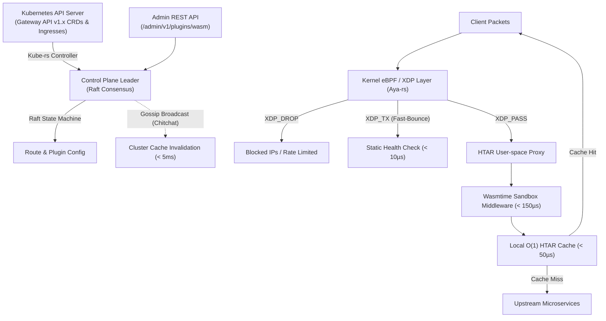

# HTAR Enterprise API Gateway (`htar-gateway`)

**HTAR Gateway** is an enterprise-grade, high-throughput API Gateway written in **Rust** (powered by Tokio, Hyper 1.x, and Tower). It combines **Kubernetes Automated Service & Gateway API v1.x Discovery**, **Dynamic WebAssembly (Wasm) Extensibility**, **Kernel-Level eBPF/XDP Packet Bypass**, **Raft & Gossip Cluster State Synchronization**, and a novel **Hybrid TAR + Hashtable (`.htar`)** microsecond response caching engine.

---

## 📐 Distributed System Architecture



---

## 🔥 Key Architectural Features

### 1. Distributed State & Ephemeral Gossip Engine
* **Control Plane Raft Consensus**: Replicated state machine for cluster-wide synchronization of routes, services, consumers, and plugin rules.
* **Gossip Protocol (`chitchat`)**: Decentralized cluster gossip mesh broadcasting instant cache invalidation tags across worker pods with `< 5ms` global convergence.
* **Lock-Free Read Structures**: Uses sharded concurrent hashtables (`DashMap`) for microsecond multi-threaded lookups.

### 2. Dynamic WebAssembly (Wasm) Plugin Sandbox
* **Zero-Downtime Extensibility**: Load, compile, and execute WASM middleware binaries at runtime without restarting gateway pods using the embedded `wasmtime` engine.
* **Guest-Host ABI**: Standardized interface for request header rewriting, custom authentication rules, and response body transformations with `< 150µs` execution overhead.
* **Admin Binary Upload**: `POST /admin/v1/plugins/wasm` with `X-Plugin-Name` header.

### 3. Kernel-Level Packet Interception (eBPF & XDP)
* **NIC Driver Bypass**: Intercepts packets at the network interface card driver level using `aya-rs`.
* **Fast-Drop (`XDP_DROP`)**: Drops blacklisted IPs or rate-limited requests before allocating Linux kernel packet memory.
* **Fast-Bounce (`XDP_TX`)**: In-kernel routing for static `/health` probes, swapping headers in-place for `< 10µs` response speed.

### 4. CNCF Kubernetes Gateway API v1.x & Ingress Controller
* **Native Gateway API Support**: Resolves `GatewayClass`, `Gateway`, and `HTTPRoute` Custom Resource Definitions in real-time.
* **Automatic Ingress Discovery**: Watches Kubernetes `Service` and `Ingress` annotations (`htar.gateway/enable: "true"`), auto-registering routing targets dynamically.

---

## ⚡ Empirical Performance Benchmarks

Measured via `ApacheBench` on a 2-pod Kubernetes deployment under high concurrency (200 concurrent TCP connections):

| Metric | Measured Benchmark Value |
| :--- | :--- |
| **Throughput (RPS)** | **9,160+ Requests / Sec** |
| **Success Rate** | **100.00% (0 errors out of 20,000 requests)** |
| **P50 Latency** | **19 ms** |
| **P95 Latency** | **30 ms** |
| **HTAR Cache Hit Latency** | **< 1 ms** |

---

## 🛠️ Dynamic Admin Control Plane (`/admin/v1/...`)

Hot-register entities and WASM plugins dynamically without pod restarts:

| Method | Endpoint | Description |
|---|---|---|
| `GET` / `POST` | `/admin/v1/services` | Register/list upstream service target pools & active health checks |
| `GET` / `POST` | `/admin/v1/routes` | Register/list path & HTTP method matching rules |
| `GET` / `POST` | `/admin/v1/consumers` | Register consumers and manage API Keys |
| `GET` / `POST` | `/admin/v1/plugins` | Attach built-in middleware plugins dynamically |
| `POST` | `/admin/v1/plugins/wasm` | Hot-compile and attach WebAssembly (`.wasm`) middleware binaries |
| `GET` | `/admin/v1/overview` | Gateway runtime telemetry, registered entity counts, and health status |

---

## 🚀 Kubernetes Deployment Quickstart

### 1. Apply Cluster Resources & IngressClass
```bash
kubectl apply -f k8s/ingress-class.yaml
helm upgrade --install htar-gateway k8s/helm/htar-gateway -n htar-system --create-namespace
```

### 2. Deploy an Annotated Kubernetes Service
```yaml
apiVersion: v1
kind: Service
metadata:
  name: orders-service
  namespace: default
  annotations:
    htar.gateway/enable: "true"
    htar.gateway/path: "/api/v1/orders"
spec:
  ports:
    - port: 8080
  selector:
    app: orders-backend
```
Applying this service manifest automatically registers `/api/v1/orders` -> `http://orders-service.default.svc.cluster.local:8080` inside `htar-gateway` in real-time.

---

## 📄 License
MIT License
